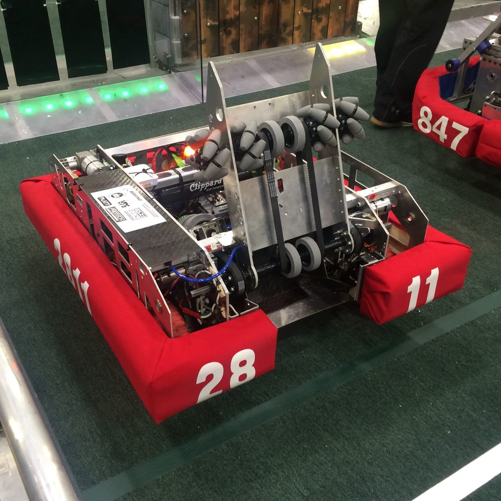

# StrongHold
Robot software for the 2016 competition.

## Documentation

For a brief description of the primary robot subsystems, see our [Subsystems Documentation](docs/README.md)

For tasks and behaviours our robot is capable of performing see our [Behaviors Documentation](docs/BEHAVIORS.md)

Learning is a critical part of every FRC season. Our  [Lessons Learned ](docs/LESSONS.md) page covers some of the more interesting things discovered this build season.
