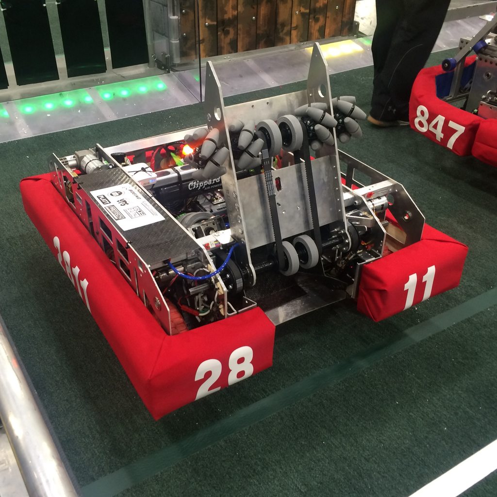

# StrongHold Robot Subsystems

## Major Subsystems

### Lifter
The physical system consists of arm with roughly a 120% range of freedom. It's a core component of the robot, responsible for all external interaction with obstacles, as well as boulder pickup.

[See the code for the Lifter and Intake systems][intakelifter]

The up-down (Lifter) portion a PID based system controlled by a Talon SRX, using a CTRE mag encoder for positional feedback. This uses a chained PID controllers. 
The outer controller is responsible for the position, and the inner one controls the current. The primary reason for this was to have both solid positioning, but maintain the built-in current limiting capabilities of the Talon SRX.
This was initially built using the FRC framework's PID library, however due to integration issues the angular PID control is implemented as a hand-written PI loop. 

The belt-driven intake system is driven by another Talon SRX, also using a CTRE mag encoder for feedback. The feedback allows us to reposition the ball before feeding into the shooting mechanism, which makes for more consistent shots. 

### Shooter
The shooter mechanism consists of two 775 Pro motors, controlling large spinning disks with CTRE mag encoders for velocity feedback. The encoders were primarily chosen for integration with our drive and gear system, and due to reliability issues we've experienced with optical PID systems in the past.

[Shooter system code][shooter]

The shooter mechanics are at a fixed operating angle, which can be changed with a few bolts. The angle was chosen based on a few parameters
- Can make shots from the outer works
- Can make shots from midfield
- Shots should score at the apex, in order to provide the greatest room for error.
- Shooting from batter is not a priority.

In execution, the goal of shooting for the apex resulted in very high vertical accuracy. With 2 power settings, the robot is capable of making a shot from anywhere in the courtyard (roughly from 6-12 feet and 10-16 feet). 

Computer vision was used to provide values needed to calculate the shot trajectory and optimal power settings. The Shooter system contains the necessary trig to convert the computed vision data into motor RPM, and fed into a the PID of the motors. 

### Chassis
Due to the nature of the competition, our chassis was a very high priority in terms of mechanical reliability. The system has a 2 position pneumatic gearbox for high speed and high torque, and an encoder for more advanced programming options. 

[See Chassis subsystem code][chassis]

During competition, we opted to use a fairly standard open-loop control scheme for the teleop mode. 

For auto mode, the encoders were used to provide a distance limit for driving. This aided significantly in rough positioning. 

During testing and building of our practice robot, we implemented more complex control mechanics for teleop. However, due to insufficient time to fully tune these systems, they were removed as PID oscillations and I term buildup were causing excess drive train wear.

The Chassis also has a Nav-X MXP Gyro on board. This was used to provide a "about face" operation, which allowed the driver to align the robot with the obstacles. It was also used in some early Auto code to ensure that the robot was facing the correct way after crossing obstacles. 

### Vision 
The Computer Vision system was used primarily to help align the robot for accurate shooting, and for distance control. 

[Java Subsystem][vision]

The subsystem was designed with an API to encapsulate all network table, CV, and trigonometry code. The API was designed to return 2 primary values: The angle needed to turn to the target, and the distance to the target. The `distanceToFPS` of the [shooter system][shooter] function then takes the distance in feet, and calculates the needed output velocity of the motors. 

[Java class for storing detected objects][visiontarget]

The Vision system was run on a laptop using GRIP, and using NetworkTables to pass values back to the RoboRio for further processing.
[GRIP Code](../project.grip)

[shooter]: ../Stronghold2016/src/org/usfirst/frc2811/Stronghold2016/subsystems/Shooter.java
[visiontarget]: ../Stronghold2016/src/org/usfirst/frc2811/Stronghold2016/VisionTarget.java
[vision]: ../Stronghold2016/src/org/usfirst/frc2811/Stronghold2016/subsystems/Vision.java

[intakelifter]: ../StrongHold2016/src/org/usfirst/frc2811/StrongHold2016/subsystem/IntakeLifter.java

[chassis]: ../StrongHold2016/src/org/usfirst/frc2811/StrongHold2016/subsystem/IntakeLifter.java